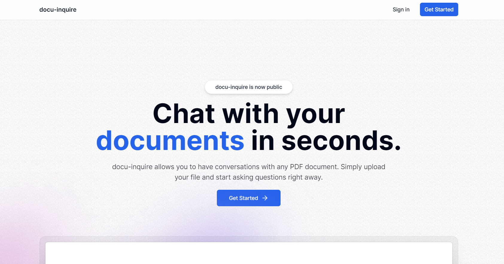

# docu-inquire

Docu-inquire is platform allowing users to engage in conversational interactions with PDF documents using LLM by Open AI.



[Click here](https://docu-inquire.vercel.app/) for live version

## 👨‍💻 Built With

- [](https://www.typescriptlang.org/)
- [](https://nextjs.org/)
- [](https://trpc.io/)
- [](https://www.prisma.io/)
- [Kinde Auth](https://kinde.com/)
- [Langchain](https://www.langchain.com/)
- [Open AI](https://openai.com/)

### UI Frameworks

- [](https://tailwindcss.com/)
- [shadcn UI](https://ui.shadcn.com/)

### Databases used

- [Pinecone](https://www.pinecone.io/) (Vector Database)
- [Aiven](https://aiven.io/) (MySQL Database)
- [uploadthing](https://uploadthing.com/) (File Storage)

## Local Setup & Installation

- Clone the repo

```
$ git clone https://github.com/aviralj02/https://github.com/aviralj02/docu-inquire
```

- Install packages

```
$ yarn install
```

- Create a `.env.local` file and fill up the details like in [.env.example](./.env.example)

- Run the following command to generate the Prisma client based on your schema

```
npx prisma generate
```

- If you have made any changes to the schema, you need to run prisma migrations to sync your database with the schema

```
npx prisma migrate dev
```

- Spin up the development server

```
$ yarn dev
```

### Upload Status Information

PENDING - File not uploaded yet
PROCESSING - File is uploaded on uploadthing but not indexed on vector db.
FAILED - Either not able to get indexed on vector db or not able to connect with OpenAI.
SUCCESS - Uploaded + Connected with OpenAI + Vectorized on Pinecone.
